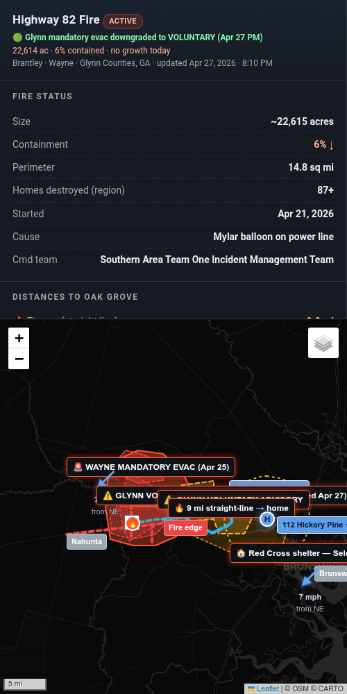

# 🔥 Highway 82 Fire — Live Interactive Map

[](https://naomiwolfe.github.io/highway-82-fire-map/)
[](https://app.watchduty.org/i/94228)
[](#-license)
[](https://leafletjs.com/)

A personal wildfire tracking tool built during the **Highway 82 Fire** (Brantley / Wayne / Glynn Counties, GA · April 2026).

**👉 Live map:** https://naomiwolfe.github.io/highway-82-fire-map/


---

## 🏡 Why I built this

I live in Brunswick, Georgia — on an island surrounded by salt marsh, in the Oak Grove neighborhood of Glynn County. On April 21, 2026, a wildfire started in Brantley County, about 20 miles inland from us. Within a week it had grown to over 22,000 acres, destroyed roughly 90 homes, and forced mandatory evacuations across three counties. At its closest, the fire edge was less than 10 miles from my front door.

I needed a single place that could answer the questions I kept asking out loud:

> 🔥 How close are the flames to my house, *right now?*
>
> 🚨 Where is the mandatory evac line, and how far is it from us?
>
> 💨 What's the wind doing in the next 12 hours, and which way will that push the fire?
>
> 🚧 Did Murphy Road in Brantley get cut off?
>
> 😷 Is the smoke bad enough to keep my college-age kid home from her outdoor shift?

No single official source answered all of these for *my* address. Watch Duty had perimeter data. The Georgia Forestry Commission had acreage. NWS had wind forecasts. Glynn County had evacuation orders. Action News Jax had road closures. I needed all of it composed together, with **my house as the reference point**.

So I built it. And then I shared it — with family, then with neighbors, then publicly.

---

## 🗺️ What it does

| | |
|---|---|
| 🔥 | Current fire perimeter from Watch Duty / NIFC |
| 🚨 | Evacuation zones (mandatory + voluntary) for Brantley, Wayne, and Glynn |
| 🚧 | Road closures from Brantley Sheriff and Glynn County |
| 📏 | Straight-line distances from home to: flames, nearest evac edge |
| 💨 | Three wind-driven spread scenarios with switchable projection cones |
| ⏱️ | Live wind forecast pulled hourly from NWS |
| ⚠️ | A 5-mile trigger ring around home — the line at which I'd evacuate |
| 🔄 | Auto-rebuilds every 4 hours and pushes to GitHub Pages |

<p align="center">
  
</p>

---

## 📡 Sources

All data comes from authoritative public sources, refreshed automatically:

- 🛰️ [Watch Duty](https://app.watchduty.org/i/94228) — fire perimeter, acres, containment
- 🌲 [Georgia Forestry Commission](https://gatrees.org/current-wildfire-information-and-resources/) — daily fire status
- 👮 [Brantley County Sheriff](https://www.facebook.com/BrantleyCountySO) — evacuations, road closures, curfew
- 🏛️ [Glynn County](https://www.glynncounty.org/news/) — evacuation orders, road closures
- 🌬️ [NWS](https://api.weather.gov/) — hourly + multi-day wind forecast
- 📰 Action News Jax and News4Jax — supplementary reporting

---

## 🛠️ How it's built

- **Frontend** — Single HTML file with [Leaflet.js](https://leafletjs.com/), no framework. Dark theme, responsive sidebar.
- **Wind data** — Fetched from `api.weather.gov` (NWS) and stored in `wind.json`
- **Routes** — Computed via OSRM and cached in `routes.json`
- **Refresh** — A scheduled task re-pulls all sources every 4 hours, regenerates the map, redeploys, and pushes a commit to this repo. GitHub Pages auto-rebuilds within ~1 minute.
- **Hosting** — GitHub Pages. Free, no sign-in needed. Anyone with the link can view.
- **AI assistance** — Built with [Perplexity Computer](https://www.perplexity.ai/) as a coding partner. I made the decisions; it wrote the code.

---

## 💭 What I learned

This project taught me more about **risk communication** than any book I've read on the subject. A few things stand out:

### 🎯 The hardest part wasn't the code — it was deciding what to include
Every map element was a tradeoff between completeness and clarity. The first version had everything I could find. The version that actually helped people had a fraction of that, organized around one question: *"should I evacuate?"*

### 🎨 Default views matter
When the wind forecast shifted to easterly, I changed the default scenario on the map from "current SW wind" to "PM/Tonight: E wind (forecast)." That single change made the map answer the right question for the next 12 hours. The data didn't change — the framing did.

### 🔁 Iteration with real users beat any plan
I had a working map after the first build. It wasn't useful until a friend asked about specific evacuation mileage and a neighbor asked about a road I hadn't included. Every revision came from someone using it and asking a question it couldn't answer yet.

### ⏸️ Knowing when to pause is part of the work
I had cron jobs running hourly fire checks and 4-hour map refreshes. After the fire stabilized, I paused them. Not every signal needs a notification.

---

## 📁 Files

```
.
├── index.html                  # Main map — all logic, all UI
├── wind.json                   # NWS wind forecast (refreshed every 4h)
├── routes.json                 # OSRM driving routes
├── README.md                   # You are here
├── screenshot-overview.png     # Wide map preview
└── screenshot-sidebar.png      # Sidebar detail
```

---

## 📜 License

**MIT.** Use any of this for your own community if it helps. Adapt the structure, the source list, the layout — whatever works.

If you build something similar for your area and want to compare notes, I'd love to hear about it.

---

— Naomi Wolfe · [@NaomiWolfe](https://github.com/NaomiWolfe) · Brunswick, GA 🌾
