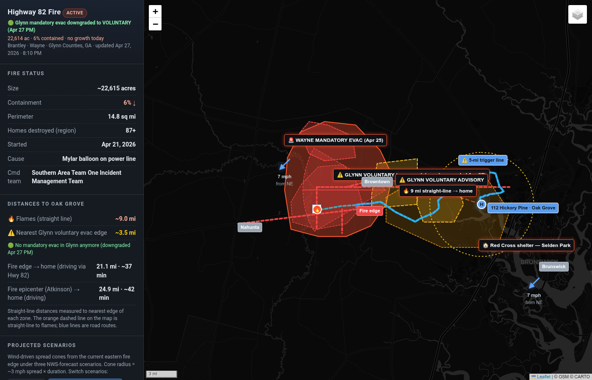

# Highway 82 Fire — Live Interactive Map

A personal wildfire tracking tool built during the Highway 82 Fire (Brantley / Wayne / Glynn Counties, GA, April 2026).

**Live site:** https://naomiwolfe.github.io/highway-82-fire-map/



## Why I built this

On April 21, 2026, a wildfire started in Brantley County, Georgia. Over the next week it grew to over 22,000 acres, destroyed ~90 homes, and forced mandatory evacuations in three counties. My family lives in the Oak Grove neighborhood of Glynn County, less than 10 miles from the fire edge at its closest.

I needed a single place that could answer the questions I kept asking out loud:

- How close are the flames to my house, right now?
- Where is the mandatory evac line, and how far is it from us?
- What's the wind doing in the next 12 hours, and which way will that push the fire?
- Did Murphy Road in Brantley get cut off? (My dad has cousins there.)
- Is it safe for my 19-year-old to work her outdoor shift on Jekyll Island tonight?

No single official source answered all of these for *my* address. Watch Duty had perimeter data. The Georgia Forestry Commission had acreage. NWS had wind forecasts. Glynn County's Facebook had evacuation orders. Action News Jax had road closures. I needed them composed together, with my house as the reference point.

So I built it. And then I shared it — first with family over text, then with neighbors, then publicly.

## What it does

- Shows the current fire perimeter (from Watch Duty / NIFC) on an interactive Leaflet map
- Overlays evacuation zones for Brantley, Wayne, and Glynn counties (mandatory + voluntary)
- Marks road closures from Brantley Sheriff and Glynn County
- Calculates straight-line distances from my home to: the flames, the nearest mandatory evac edge, the nearest voluntary evac edge
- Shows three wind-driven spread scenarios as projection cones, switchable by button
- Pulls live wind forecasts from NWS for the fire area
- Provides a 5-mile trigger ring around home — the threshold at which I'd evacuate
- Auto-rebuilds every 4 hours and pushes to GitHub Pages so the public link always shows current data

## Sources

All data is from authoritative public sources, refreshed automatically:

- [Watch Duty](https://app.watchduty.org/i/94228) — fire perimeter, acres, containment
- [Georgia Forestry Commission](https://gatrees.org/current-wildfire-information-and-resources/) — daily fire status
- [Brantley County Sheriff](https://www.facebook.com/BrantleyCountySO) — evacuations, road closures, curfew
- [Glynn County](https://www.glynncounty.org/news/) — evacuation orders, road closures
- [NWS](https://api.weather.gov/) — hourly + multi-day wind forecast
- Action News Jax and News4Jax — supplementary reporting

## How it's built

- **Frontend:** Single HTML file with [Leaflet.js](https://leafletjs.com/), no framework. Dark theme, responsive sidebar.
- **Wind data:** Fetched from `api.weather.gov` (NWS) and stored in `wind.json`
- **Routes:** Computed via OSRM and cached in `routes.json`
- **Refresh:** A scheduled task re-pulls all sources every 4 hours, regenerates the map, redeploys, and pushes a commit to this repo. GitHub Pages auto-rebuilds within ~1 minute.
- **Hosting:** GitHub Pages, free, no sign-in needed. Anyone with the link can view.
- **AI assistance:** Built with [Perplexity Computer](https://www.perplexity.ai/) as a coding partner — I made the decisions, it wrote the code.

## What I learned

This project taught me more about risk communication than any book I've read on the subject. A few things stand out:

**The hardest part wasn't the code — it was deciding what to include.** Every map element I added was a tradeoff between completeness and clarity. The first version had everything I could find. The version that actually helped people had a fraction of that, organized around the question "should I evacuate?"

**Different audiences need different framings.** I drafted the same fire update three times: once as a casual "mom-voice" text to my daughter (short, no bold, "love you 🤍"), once as a neighborhood update (emoji bullets, distances, action items), once for a friend asking about a specific road in a specific county. Same data, three different translations. As an instructional designer this is familiar work — but doing it in real-time during a crisis, with stakes, was a different kind of practice.

**Default views matter.** When the wind forecast shifted to easterly, I changed the default scenario on the map from "current SW wind" to "PM/Tonight: E wind (forecast)." That single change made the map answer the right question for the next 12 hours. The data didn't change. The framing did.

**Iteration with real users beat any plan.** I had a working map after the first build. It wasn't useful until my dev friend asked about specific evacuation mileage and a neighbor asked about a road I hadn't included. Every revision came from someone using it and asking a question it couldn't answer yet.

**Knowing when to pause is part of the work.** I had cron jobs running hourly fire checks and 4-hour map refreshes. After the fire stabilized, I paused them. Not every signal needs a notification.

## Files

```
.
├── index.html       # Main map, all logic, all UI
├── wind.json        # NWS wind forecast (refreshed every 4h)
├── routes.json      # OSRM driving routes (rarely updated)
├── README.md        # You are here
└── screenshot.png   # Map preview
```

## License

MIT. Use any of this for your own community if it helps. Adapt the structure, the source list, the texting templates — whatever works.

If you build something similar for your area and want to compare notes, I'd love to hear about it.

— Naomi Wolfe ([@NaomiWolfe](https://github.com/NaomiWolfe))
